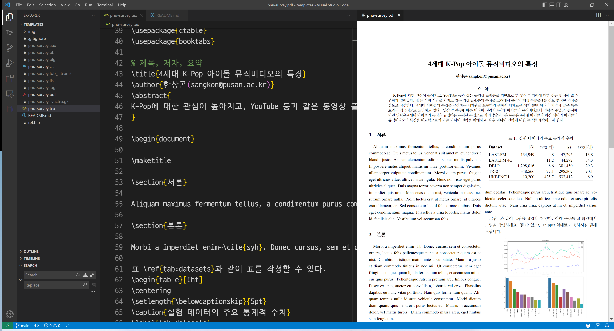
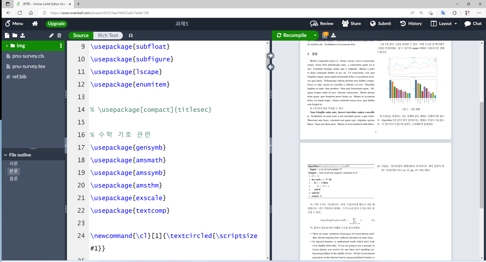

# 부산대학교 공학작문 LaTeX 템플릿

> 부산대학교의 `공학작문`(ZE10117-101, ZE10117-102) 수업의 과제 중 Survey 논문용 LaTeX 템플릿을 공유합니다.

----------

해당 템플릿은 [1]에서 제작한 내용에 기초 하여 과제에 활용하기 쉽도록 수정하였습니다.

모든 과정은 `VSCode`에서 가능하지만, 컴퓨터 환경에 따라서 오류가 발생할 수 있습니다. LaTeX 설치가 힘들거나, VSCode와 같은 편집기 사용이 어렵다면 `Overleaf`를 활용하세요.

[Overleaf](https://www.overleaf.com/read/fwzbpvbbgbqd)를 활용해서 작성하기를 권합니다.

## 참고문헌

[1] https://github.com/alapha23/Kiise-Latex-template